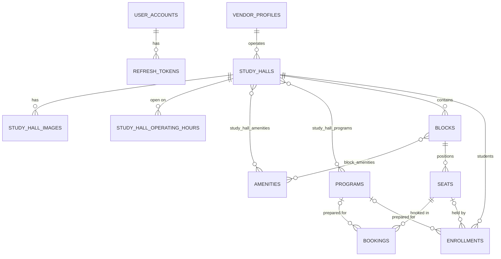

# SPACZ Platform — Architecture

The final architecture of the SPACZ backend: five Spring Boot services, one database per service.
It consolidates the earlier `spacz-platform`, the Partner app's `spacz-partner-service`, and the
relevant parts of the `spacz/` monolith. How that consolidation was done, and why, is in
[MIGRATION_PLAN.md](MIGRATION_PLAN.md).

---

## 1. Overview

```
 Student app ─┐                ┌──────────────────────────┐
 Vendor app ──┼──────────────► │  spacz-gateway-service   │ :8080  routing · CORS · JWT pre-check ·
 Admin app  ──┤                │  (Spring Cloud Gateway)  │        correlation IDs · Swagger aggregation
 Partner app ─┘ (legacy API)   └────────────┬─────────────┘        no database
          ┌─────────────────────┬───────────┴───────────┬───────────────────────┐
          ▼                     ▼                       ▼                       ▼
 ┌──────────────────┐ ┌──────────────────┐ ┌──────────────────────┐ ┌──────────────────┐
 │ auth  :8081      │ │ user  :8082      │ │ studyhall  :8083     │ │ admin  :8084     │
 │ accounts, email/ │ │ student profiles,│ │ vendors, halls,      │ │ admin profiles,  │
 │ password + phone │ │ exam choices,    │ │ blocks, seats,       │ │ audit log,       │
 │ OTP, JWT, refresh│ │ activity         │ │ programs, amenities, │ │ dashboard,       │
 │ tokens           │ │                  │ │ bookings, enrollments│ │ approvals        │
 └────────┬─────────┘ └────────┬─────────┘ └──────────┬───────────┘ └────────┬─────────┘
          ▼                    ▼                      ▼                      ▼
     [spacz_auth]         [spacz_user]        [spacz_studyhall]        [spacz_admin]
          └────────── PostgreSQL 16: one database + one login role per service ────────┘
```

* **Database isolation.** Each service has its own database and login role. `PUBLIC` is denied
  `CONNECT`, so one service's credentials cannot open another service's database (verified).
* **No cross-service foreign keys or JPA relationships.** A reference to another service's data is a
  plain `BIGINT` ID, plus a name snapshot where reads need it.
* **Defense in depth.** Every service validates the JWT and checks ownership itself. The gateway's
  checks only reject bad requests early.
* **Tech:** Java 17, Spring Boot 3.4.2, Spring Cloud 2024.0.0 (gateway), Spring Security OAuth2
  resource server (HS256 JWT), Spring Data JPA/Hibernate 6, Flyway, PostgreSQL 16, springdoc 2.8,
  Lombok, Docker Compose.

## 2. Service responsibilities

| Capability | auth | user | studyhall | admin | gateway |
|---|:-:|:-:|:-:|:-:|:-:|
| Registration, login (email+password, **phone OTP**), refresh/logout, JWT | **owner** | | | | |
| Roles (ADMIN / USER / VENDOR), account status (can this identity log in?) | **owner** | | | | |
| Student profile & preferences | | **owner** | | | |
| Student exam/course choices (`UserProgram`) | | **owner** | | | |
| Student activity history | | **owner** | writes (async) | reads | |
| Vendor / institute profile, **approval status** | | | **owner** | manages via API | |
| Study halls (branches), images, hours, amenities | | | **owner** | moderates via API | |
| **Blocks** (sections with own prices/amenities), seats, seating grids | | | **owner** | | |
| **Program (exam/course) catalog**, amenity catalog | | | **owner** (ADMIN writes) | | |
| Bookings (daily/monthly), availability, double-booking prevention | | | **owner** | reads via API | |
| **Enrollments** (a hall's students, incl. walk-ins) | | | **owner** | reads via API | |
| Legacy Partner-app API (owner/property/block/seat/amenity/image) | | | **owner** | | |
| Admin profile, dashboard aggregation, approval workflows | | | | **owner** | |
| Audit log (admin actions + domain events from other services) | | | | **owner** | |
| Routing, CORS, correlation ID, Swagger aggregation | | | | | **owner** |

## 3. Database ownership & entities

### `spacz_auth`
| Table | Entity | Notes |
|---|---|---|
| `user_accounts` | `UserAccount` | email and/or phone (both unique, at least one), BCrypt hash (null for OTP-only accounts), role, status, lockout, `legacy_login_id` |
| `refresh_tokens` | `RefreshToken` | SHA-256 of the opaque token, expiry, revocation (rotation + reuse detection) |
| `otp_challenges` | `OtpChallenge` | HMAC of the code, expiry, attempts, consumed flag, requester IP |

### `spacz_user`
| Table | Entity | Notes |
|---|---|---|
| `user_profiles` | `UserProfile` | `user_id` (auth ID, unique), names, phone, email (optional), city, preferences |
| `user_programs` | `UserProgram` | `user_id`, `program_id` (studyhall ID) + code/name snapshot, dates, status |
| `user_activities` | `UserActivity` | append-only history (profile, program and booking events) |

### `spacz_studyhall`
| Table | Entity | Legacy source | Notes |
|---|---|---|---|
| `vendor_profiles` | `VendorProfile` | `owner` | `vendor_id` (auth ID), business details, status `DRAFT → PENDING → APPROVED …`, `legacy_owner_id` |
| `study_halls` | `StudyHall` | `property` | vendor's branch; address, lat/lng (was "lat,lng" text), default daily/monthly price, status |
| `study_hall_images` | `StudyHallImage` | `image` | URL, caption, order, cover |
| `study_hall_operating_hours` | `OperatingHours` | — | one row per weekday |
| `amenities` | `Amenity` | `amenity` flags | admin-managed catalog |
| `study_hall_amenities`, `block_amenities` | join tables | `amenity` (per block) | hall-wide and block-specific amenities |
| `programs` | `Program` | — | exam/course catalog (UPSC, SSC, GATE, EAMCET, NEET …), admin-managed |
| `study_hall_programs` | join table | — | exams a hall caters for |
| `blocks` | `Block` | `block` | section as a rows × columns grid (cells without a seat = gaps), own daily/monthly price |
| `seats` | `Seat` | `seat` | number, row, column, type, status (`AVAILABLE`/`RESERVED`/`MAINTENANCE`/`INACTIVE`), price overrides |
| `bookings` | `Booking` | `booking` | user, seat, `DAILY`/`MONTHLY` plan, dates, price, status; **exclusion constraint** |
| `enrollments` | `Enrollment` | — | a hall's student: account or walk-in guest, exam, seat, period, status |

Every migrated row keeps its MySQL ID in a `legacy_*` column (traceability and idempotent re-runs).

### `spacz_admin`
| Table | Entity | Notes |
|---|---|---|
| `admin_profiles` | `AdminProfile` | `admin_user_id` (auth ID), name, title, contact |
| `audit_logs` | `AuditLog` | actor, action, entity, description, IP, correlation ID, source service. **Append-only** (DB trigger) |

## 4. Entity relationships (inside each service)



Cross-service references (IDs only):

```
auth user_accounts.id ─► user_profiles.user_id, user_programs.user_id, user_activities.user_id   (user)
                      ─► vendor_profiles.vendor_id, bookings.user_id, enrollments.user_id       (studyhall)
                      ─► audit_logs.actor_user_id, admin_profiles.admin_user_id                 (admin)
studyhall programs.id ─► user_programs.program_id (+ code/name snapshot)                        (user)
```

**Pricing** resolves seat → block → hall, separately for the daily and the monthly price. A
`MONTHLY` booking is only offered when a monthly price resolves.

## 5. API (through the gateway)

`/internal/**` is service-to-service only: the gateway never routes it, and each service requires
`X-Internal-Api-Key`.

**auth-service**
```
POST /api/auth/register            {role: USER|VENDOR, email, password, ...}   (+ /register/user, /register/vendor)
POST /api/auth/login               email (or phone) + password
POST /api/auth/otp/request         {phone}  → code by SMS          (429 OTP_TOO_SOON / OTP_RATE_LIMITED)
POST /api/auth/otp/verify          {phone, code[, role, firstName ...]}  → login, or register a new number
POST /api/auth/refresh | /logout   GET /api/auth/me   PUT /api/auth/me/password
internal: GET/PATCH /internal/accounts[/{id}[/status]]  GET /internal/accounts/stats  POST /internal/accounts/import
```
**user-service**
```
GET|PUT /api/users/me                         GET /api/users/{id} (self|ADMIN)   PUT /api/users/{id} (self)
GET|POST /api/users/me/programs               PUT|DELETE /api/users/me/programs/{id}
GET /api/users/me/enrollments                 GET /api/users/me/activity
GET /api/users/{id}/programs | /enrollments | /activity     (self|ADMIN)
internal: POST /internal/users  GET /internal/users[?ids=]  GET /internal/users/{id}[/programs|/activity]
          POST /internal/users/{id}/activities
```
**studyhall-service**
```
Vendors     POST /api/vendors   GET|PUT /api/vendors/me   POST /api/vendors/me/submit   GET /api/vendors/{id} (public)
            GET /api/vendors/me/studyhalls | /me/students | /me/bookings
Study halls GET /api/studyhalls (search) · GET /api/studyhalls/{id} · GET /{id}/availability      (public)
            POST /api/studyhalls · PUT|DELETE /{id} · POST /{id}/submit · PATCH /{id}/status      (vendor)
            PUT /{id}/operating-hours · POST|DELETE /{id}/images|amenities|programs[/{x}]
Seating     GET /{id}/seats (public seat map) · POST /{id}/seats · PUT|DELETE /{id}/seats/{seatId}
            GET|POST /{id}/blocks · PUT|DELETE /{id}/blocks/{blockId}
Students    GET|POST /{id}/enrollments · PATCH /{id}/enrollments/{eid} · GET /{id}/bookings
Catalogs    GET /api/programs[/{id}] · GET /api/amenities (public);  POST|PUT|DELETE (ADMIN), GET /all (ADMIN)
Bookings    POST /api/bookings · GET /api/bookings/me · GET /{id} · POST /{id}/confirm|cancel
Legacy      /api/owners · /api/properties · /api/blocks · /api/seats · /amenities · /images   (VENDOR)
internal:   /internal/vendors[/{id}[/status]] · /internal/studyhalls[/{id}[/status]] · /internal/bookings
            /internal/enrollments?userId= · /internal/programs/lookup?ids= · /internal/stats
            POST /internal/import/vendors · POST /internal/import/bookings
```
**admin-service** (all ADMIN)
```
GET /api/admin/dashboard            GET|PUT /api/admin/me
GET /api/admin/users[/{id}[/activity]]          POST /api/admin/users/{id}/suspend|activate
GET /api/admin/vendors[/{id}]                   POST /api/admin/vendors/{id}/approve|reject|suspend|activate
GET /api/admin/studyhalls[/{id}]                POST /api/admin/studyhalls/{id}/approve|reject|suspend|activate
GET /api/admin/bookings                         GET /api/admin/audit-logs
internal: POST /internal/audit-events
```

Every list endpoint takes `page`, `size` (max 100) and `sort`. Every error uses the `ApiError`
shape. Full request/response schemas are in Swagger: http://localhost:8080/swagger-ui.html.

## 6. Inter-service communication

REST (`RestClient`) with a 2 s connect timeout and a 5 s read timeout, plus the headers
`X-Internal-Api-Key`, `X-Correlation-Id` (propagated) and `X-Source-Service`.

| From → to | Call | Kind |
|---|---|---|
| auth → user | `POST /internal/users` (profile at student registration) | sync, in the registration transaction (rollback on failure) |
| auth → studyhall | `POST /internal/vendors` (DRAFT profile at vendor registration) | sync, same |
| auth → admin | `POST /internal/audit-events` (USER/VENDOR_REGISTERED) | async, after commit, best effort |
| user → studyhall | `GET /internal/programs/lookup`, `GET /internal/enrollments` | sync read, 503 on outage |
| studyhall → user | `GET /internal/users?ids=` (student names for vendors) | sync read, degrades to null |
| studyhall → user | `POST /internal/users/{id}/activities` (booking events) | async, after commit, best effort |
| studyhall → admin | `POST /internal/audit-events` (hall/vendor/program/amenity events) | async, after commit, best effort |
| admin → auth / user / studyhall | accounts, profiles, programs, activity, vendors, halls, bookings, enrollments, stats | sync; the dashboard calls in parallel and degrades per service |

user ↔ studyhall calls go in both directions, as do auth/studyhall → admin → auth/studyhall. That
is acceptable here because no call runs at startup, none spans a transaction across services, and
every write in the reverse direction is async fire-and-forget. A message broker (transactional
outbox) is the upgrade path if those pushes need guaranteed delivery.

## 7. Flows

**Registration.** Email/password: auth creates the account and calls user-service (student) or
studyhall-service (vendor, `DRAFT`) inside the same transaction, then issues tokens.
Phone OTP:
1. `otp/request` stores an HMAC of a random 6-digit code (valid 5 minutes, at most 5 attempts, a
   30-second resend cooldown and at most 5 codes per hour) and sends it by SMS. The `log`
   provider writes it to the log in development.
2. `otp/verify` logs in an existing number.
3. For a new number it answers `422 REGISTRATION_REQUIRED` *without consuming the code*. The client
   repeats the call with `role` (and `firstName` for students) to register.

**Vendor approval.** The vendor completes the profile, then `POST /api/vendors/me/submit`
(DRAFT → PENDING). It creates halls, blocks and seats, then `POST /api/studyhalls/{id}/submit`
(→ PENDING_APPROVAL). The admin approves the vendor and the hall in either order: a hall approved
before its vendor waits in `APPROVED` and goes `ACTIVE` when the vendor is approved. Each admin
action is audited with actor, IP and correlation ID. Suspending a vendor hides its halls and makes
it read-only.

**Booking.**
1. Request: `POST /api/bookings {plan DAILY|MONTHLY, dates or months, seat, programId?}`.
2. Seat row lock (`SELECT … FOR UPDATE`).
3. Expire stale holds on that seat.
4. Overlap check.
5. The server computes the price (seat → block → hall).
6. The booking is saved as `PENDING` with a 15-minute hold. The PostgreSQL exclusion constraint
   `EXCLUDE USING gist (seat_id =, daterange &&) WHERE status IN (PENDING, CONFIRMED)` is the last
   line of defense.
7. `confirm` → `CONFIRMED`, which creates or extends the student's **enrollment** in the hall.
8. A scheduled job expires holds, completes finished bookings and ends lapsed enrollments.

**Walk-in students.** `POST /api/studyhalls/{id}/enrollments {guestName|userId, seatId?}`. The seat
becomes `RESERVED` (not bookable online) until the enrollment ends.

## 8. State machines

* **Vendor:** `DRAFT|REJECTED →(vendor submit) PENDING →(admin) APPROVED | REJECTED`;
  `APPROVED|ACTIVE|INACTIVE → SUSPENDED → ACTIVE`. *Operational* = `APPROVED` or `ACTIVE`.
* **Study hall:** `DRAFT|REJECTED →(submit) PENDING_APPROVAL →(admin approve) ACTIVE` (or
  `APPROVED` until the vendor is operational); `ACTIVE ⇄ INACTIVE` (vendor);
  `* → SUSPENDED → ACTIVE` (admin).
* **Booking:** `PENDING → CONFIRMED → COMPLETED`, or `CANCELLED` / `EXPIRED`.
* **Enrollment:** `ACTIVE → COMPLETED | CANCELLED`.
* **Account:** `ACTIVE ⇄ SUSPENDED` (admin; ADMIN accounts are protected).

## 9. Design review

| Concern | Resolution |
|---|---|
| Program catalog in two services | Owned by studyhall-service; user-service keeps an ID and a snapshot. |
| Vendor identity vs. business profile | auth owns login and account status; studyhall owns business data and approval status. There is no second login system. |
| Admin users duplicated | Admins are auth accounts; admin-service keeps only `admin_profiles`. |
| Dashboard needs other databases | It aggregates each owner's `/internal/stats` over REST, in parallel, degrading per service. |
| Partner app contract | Served by studyhall-service over the new model (`controller/legacy`). Now authenticated and scoped per vendor. |
| Guessable legacy OTP | Replaced by random, hashed, expiring, rate-limited codes. |
| Double booking | Row lock + overlap check + DB exclusion constraint (tested with 12 concurrent requests on PostgreSQL). |
| Internal endpoints | Never routed by the gateway; API key checked in constant time in every service. |
| IDOR | Every vendor query is scoped by the JWT's account ID. A foreign resource is a 404. |
| Sensitive legacy data | Aadhaar numbers and addresses are not migrated (not part of the model). |
